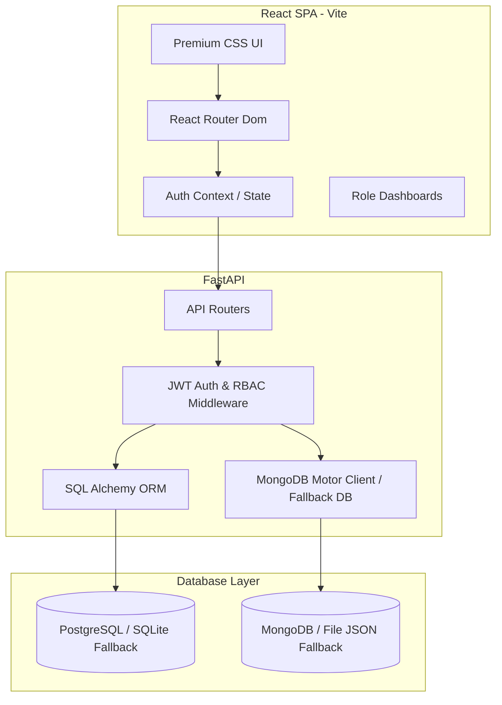

# Implementation Plan - Milestone 1: Project Initialization & Core Setup

This plan details the foundation of the **AI Debate Coach & Presentation Analysis Platform**, covering user roles, system architecture, database design, wireframes, frontend React structure, backend FastAPI setup, authentication (JWT), and the core profile/session modules.

AI-specific features (chatbot analysis, speech analysis, logical fallacy detection) are out of scope for this milestone and will be stubbed for future integrations.

---

## User Roles & Capabilities

We define four distinct user roles, each with custom dashboard views and capabilities:

1. **Learner (Default Role)**
   - Create and manage their profile (experience level, learning goals, preferred topics).
   - Browse and select debate topics.
   - Create, join, and participate in debate sessions (speaking/typing turns).
   - View their performance reports and skill tracking dashboards.
2. **Debate Coach**
   - Review debate session transcripts and performance details for students.
   - Provide evaluation feedback (score components, written comments) on completed student sessions.
   - View student skill profiles and progress reports.
3. **Educator**
   - Create and manage custom debate topics.
   - Group learners and monitor progress analytics at a class/cohort level.
   - View aggregate skill tracking dashboards.
4. **Administrator**
   - Manage user accounts (create, update, delete, change roles).
   - Manage global debate topics and system configurations.
   - View global system usage statistics.

---

## System Architecture

### Technology Stack
- **Frontend**: React (Vite, Javascript, CSS). Standard layout with dark mode aesthetics, glassmorphic headers, and clean micro-animations.
- **Backend**: FastAPI. High performance, auto-documented (Swagger/OpenAPI).
- **Databases**:
  - **Relational**: PostgreSQL via SQLAlchemy. Defaults to **SQLite** (`sqlite:///./debate_platform.db`) for instant local running if `DATABASE_URL` is omitted.
  - **Document**: MongoDB via Motor/PyMongo. Defaults to a **JSON File-Based Mock Store** in `backend/mock_db/` if `MONGODB_URL` is omitted.
- **Authentication**: JWT (JSON Web Tokens) with direct `bcrypt` password hashing.

---

## Database Schemas & Models

### Relational (SQL/PostgreSQL) - Users & Roles
1. **User Table**:
   - `id`: Integer (PK)
   - `email`: String (Unique, Indexed)
   - `hashed_password`: String
   - `role`: String (Enum: `admin`, `educator`, `coach`, `learner`)
   - `created_at`: DateTime
   - `is_active`: Boolean
2. **User Profile Table**:
   - `id`: Integer (PK)
   - `user_id`: Integer (FK to User)
   - `full_name`: String
   - `avatar_url`: String
   - `experience_level`: String (Enum: `beginner`, `intermediate`, `advanced`)
   - `learning_goals`: Text
   - `preferred_topics`: String (Comma-separated list or JSON array string)

### Document (MongoDB) - Topics, Sessions & Skills
1. **Debate Topics Collection**:
   - `_id`: ObjectId
   - `title`: String
   - `description`: String
   - `category`: String (e.g., Economics, Technology, Ethics)
   - `difficulty`: String (Beginner, Intermediate, Advanced)
   - `created_by`: Integer (User ID of Administrator or Educator)
   - `created_at`: DateTime
2. **Debate Sessions Collection**:
   - `_id`: ObjectId
   - `topic_id`: String (Reference to Debate Topic ID)
   - `title`: String
   - `learner_id`: Integer (User ID of Learner)
   - `coach_id`: Integer (Optional, User ID of Coach)
   - `status`: String (Enum: `created`, `active`, `completed`)
   - `max_turns`: Integer
   - `transcript`: Array of turn objects:
     - `speaker`: String (Enum: `learner`, `opponent`, `coach_feedback`)
     - `text`: String
     - `timestamp`: DateTime
   - `coach_feedback`: Object (Optional feedback details: score, comments)
   - `created_at`: DateTime
   - `updated_at`: DateTime
3. **Skill Tracking Collection**:
   - `_id`: ObjectId
   - `user_id`: Integer (User ID of Learner)
   - `skills`: Object:
     - `rhetoric`: Integer (0-100)
     - `logic`: Integer (0-100)
     - `delivery`: Integer (0-100)
     - `rebuttal`: Integer (0-100)
   - `history`: Array of skill snapshot objects:
     - `timestamp`: DateTime
     - `skills`: Object (Rhetoric, Logic, Delivery, Rebuttal scores)
     - `session_id`: String (Reference to Debate Session ID)

---

## UI/UX & Wireframe Design (Built-in Views)

The React SPA will showcase a sleek, dark-themed UI with deep violet/navy accents (`#111827`, `#7C3AED`, `#10B981`) and a glassmorphism style.

1. **Login & Registration**: Minimalist cards, password visibility toggle, role selection dropdown on signup.
2. **User Profile**: Card showing avatar, basic details, and editable fields for learning goals, experience level, and preferred topics.
3. **Dashboard (Dynamic)**:
   - **Learner Dashboard**: Shows current skill radial gauges, list of past debate sessions, and a prominent "Start New Debate" button.
   - **Coach Dashboard**: List of assigned learners, recent sessions requiring review/feedback, and score submit forms.
   - **Educator Dashboard**: Topic manager (Add/Edit Topics) and a simple cohort performance graph.
   - **Administrator Dashboard**: User list (with role switcher) and system configuration toggles.
4. **Debate Topic Selection**: Grid list of topics filtered by category and difficulty level.
5. **Debate Room**: Split-screen view:
   - Left side: Debate instructions, timer, and current turn info.
   - Right side: Chat transcript container showing dialogue boxes of the debate, and a mock opponent dialogue generator (for simulator purposes).
   - Bottom: Text textarea to send a speech turn and "End Session" control.
6. **Reports Dashboard**: High-quality visual cards showing skill tracking progress with progress bars and SVG charts.

---

## Proposed Changes

We will build the application in two subdirectories inside the workspace root `c:\Users\Debarshi Chatterjee\OneDrive\Desktop\Assighment 1`:
- `/frontend`: The Vite + React single-page application.
- `/backend`: The FastAPI backend with SQLite + mock MongoDB fallback.

### Component 1: Frontend (`/frontend`)

#### [NEW] [package.json](file:///c:/Users/Debarshi Chatterjee/OneDrive/Desktop/Assighment%201/frontend/package.json)
Standard react application packages, including `react-router-dom` for routing.

#### [NEW] [index.html](file:///c:/Users/Debarshi Chatterjee/OneDrive/Desktop/Assighment%201/frontend/index.html)
Initial HTML file loading Google Fonts (Inter) and main client script.

#### [NEW] [src/index.css](file:///c:/Users/Debarshi Chatterjee/OneDrive/Desktop/Assighment%201/frontend/src/index.css)
The design system core styling: dark colors, gradients, card styling, buttons, and transition keyframes.

#### [NEW] [src/App.jsx](file:///c:/Users/Debarshi Chatterjee/OneDrive/Desktop/Assighment%201/frontend/src/App.jsx)
Main component defining routes: Login, Signup, Dashboard, Profile, Topic Selection, Debate Room, Reports, Admin.

#### [NEW] [src/context/AuthContext.jsx](file:///c:/Users/Debarshi Chatterjee/OneDrive/Desktop/Assighment%201/frontend/src/context/AuthContext.jsx)
React Context API to manage user login state, role, JWT tokens, and login/logout methods.

#### [NEW] [src/pages/Login.jsx](file:///c:/Users/Debarshi Chatterjee/OneDrive/Desktop/Assighment%201/frontend/src/pages/Login.jsx)
#### [NEW] [src/pages/Signup.jsx](file:///c:/Users/Debarshi Chatterjee/OneDrive/Desktop/Assighment%201/frontend/src/pages/Signup.jsx)
#### [NEW] [src/pages/Dashboard.jsx](file:///c:/Users/Debarshi Chatterjee/OneDrive/Desktop/Assighment%201/frontend/src/pages/Dashboard.jsx)
#### [NEW] [src/pages/Profile.jsx](file:///c:/Users/Debarshi Chatterjee/OneDrive/Desktop/Assighment%201/frontend/src/pages/Profile.jsx)
#### [NEW] [src/pages/TopicSelection.jsx](file:///c:/Users/Debarshi Chatterjee/OneDrive/Desktop/Assighment%201/frontend/src/pages/TopicSelection.jsx)
#### [NEW] [src/pages/DebateRoom.jsx](file:///c:/Users/Debarshi Chatterjee/OneDrive/Desktop/Assighment%201/frontend/src/pages/DebateRoom.jsx)
#### [NEW] [src/pages/Reports.jsx](file:///c:/Users/Debarshi Chatterjee/OneDrive/Desktop/Assighment%201/frontend/src/pages/Reports.jsx)

---

### Component 2: Backend (`/backend`)

#### [NEW] [requirements.txt](file:///c:/Users/Debarshi Chatterjee/OneDrive/Desktop/Assighment%201/backend/requirements.txt)
Python packages: `fastapi`, `uvicorn`, `sqlalchemy`, `pydantic`, `python-jose[cryptography]`, `bcrypt`, `python-multipart`.

#### [NEW] [app/config.py](file:///c:/Users/Debarshi Chatterjee/OneDrive/Desktop/Assighment%201/backend/app/config.py)
Config file loading environment variables (e.g. database URLs, JWT secret key, expiration).

#### [NEW] [app/database.py](file:///c:/Users/Debarshi Chatterjee/OneDrive/Desktop/Assighment%201/backend/app/database.py)
Dual database setup:
- SQL database setup using SQLAlchemy (PostgreSQL / SQLite file fallback).
- MongoDB client setup using PyMongo/Motor with JSON file-based database fallback if MongoDB server isn't running.

#### [NEW] [app/models_sql.py](file:///c:/Users/Debarshi Chatterjee/OneDrive/Desktop/Assighment%201/backend/app/models_sql.py)
SQLAlchemy tables definitions: `User`, `UserProfile`.

#### [NEW] [app/auth_utils.py](file:///c:/Users/Debarshi Chatterjee/OneDrive/Desktop/Assighment%201/backend/app/auth_utils.py)
Utility functions for hashing passwords with `bcrypt` and creating/verifying JWT tokens.

#### [NEW] [app/routers/auth.py](file:///c:/Users/Debarshi Chatterjee/OneDrive/Desktop/Assighment%201/backend/app/routers/auth.py)
Endpoints: `/auth/register` (user creation), `/auth/login` (generates JWT token), `/auth/me` (gets current user).

#### [NEW] [app/routers/profile.py](file:///c:/Users/Debarshi Chatterjee/OneDrive/Desktop/Assighment%201/backend/app/routers/profile.py)
Endpoints: `/profile/` (GET current profile, PUT edit profile).

#### [NEW] [app/routers/topics.py](file:///c:/Users/Debarshi Chatterjee/OneDrive/Desktop/Assighment%201/backend/app/routers/topics.py)
Endpoints: `/topics/` (GET list, POST create - Educator/Admin only, DELETE - Admin only).

#### [NEW] [app/routers/sessions.py](file:///c:/Users/Debarshi Chatterjee/OneDrive/Desktop/Assighment%201/backend/app/routers/sessions.py)
Endpoints:
- `/sessions/` (GET user's sessions, POST create new session).
- `/sessions/{session_id}` (GET specific session detail).
- `/sessions/{session_id}/turn` (POST send a dialogue turn).
- `/sessions/{session_id}/end` (POST complete debate session).
- `/sessions/{session_id}/feedback` (POST submit evaluation score/text - Coach only).

#### [NEW] [app/routers/skills.py](file:///c:/Users/Debarshi Chatterjee/OneDrive/Desktop/Assighment%201/backend/app/routers/skills.py)
Endpoints: `/skills/` (GET user's current skill profile and historical data snapshots).

#### [NEW] [app/main.py](file:///c:/Users/Debarshi Chatterjee/OneDrive/Desktop/Assighment%201/backend/app/main.py)
FastAPI application initializer, CORS configuration (to connect React with FastAPI), and routing aggregator.

---

## Verification Plan

### Automated Tests
- We will set up a quick startup script or test commands to run the backend and frontend.
- We will verify backend routes using FastAPI's Swagger interface `/docs`.

### Manual Verification
1. **Startup Check**:
   - Run the FastAPI backend on `http://localhost:8000`.
   - Run the React frontend on `http://localhost:5173`.
2. **Registration and Sign-in**:
   - Register a `Learner` and a `Debate Coach`.
   - Log in and verify that the JWT token is saved and the user is redirected to their specific dashboard.
3. **Role Access Control (RBAC)**:
   - Try to access `/admin` or POST topics as a `Learner` and verify it is rejected or hide options on the frontend.
4. **Debate flow simulation**:
   - Create a session as a `Learner` on a selected topic.
   - Enter the Debate Room, write and submit a text turn.
   - End the session.
   - Log in as a `Debate Coach`, select the session, submit scores (Logic: 85, Rhetoric: 90, Delivery: 80, Rebuttal: 75) and review feedback.
   - Log in back as the `Learner` and verify their profile skill dashboard gets updated.
